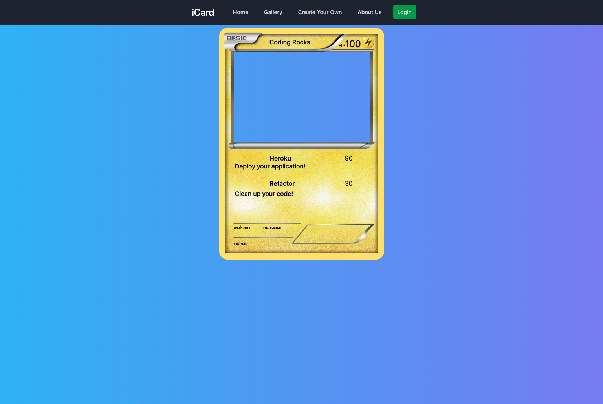

# iCard | [Deployed Site](https://icardcreator.herokuapp.com/)

## Description
 Have you ever thought your cute pet or favorite anime character deserves their own game card? Or you wanted to see your favorite Pokemon with a different typing and cool moves? Why not make your own? Using iCard, you can upload and make your own card from a selection of trading card games.
## Table of Contents
- [Installation](#installation)
- [Usage](#usage)
- [Contributing](#contributing)
- [Tests](#tests)
- [Questions](#questions)
 
## Installation
The application is deployed on Heroku <code>here</code>. No installation neccesary.
## Usage
 The user is able to view the gallery and the about us page without being logged in. Once the user is logged in, then they are able to create their own cards they can then view in the gallery.
## Contributing
 If you are interested in contributing, please refer to the [Questions](#questions) section.
## Tests
 n/a
## Questions
If you have any questions about the project or repository, open an issue or contact us at: (shaun.tehranchi@gmail.com Github@ST12345678910), (koreyluu@gmail.com Github@ahrionic), (cvg_v10@hotmail.com Github@ChrisVazquez6), (hsuzach@gmail.com Github@hsuzach).
